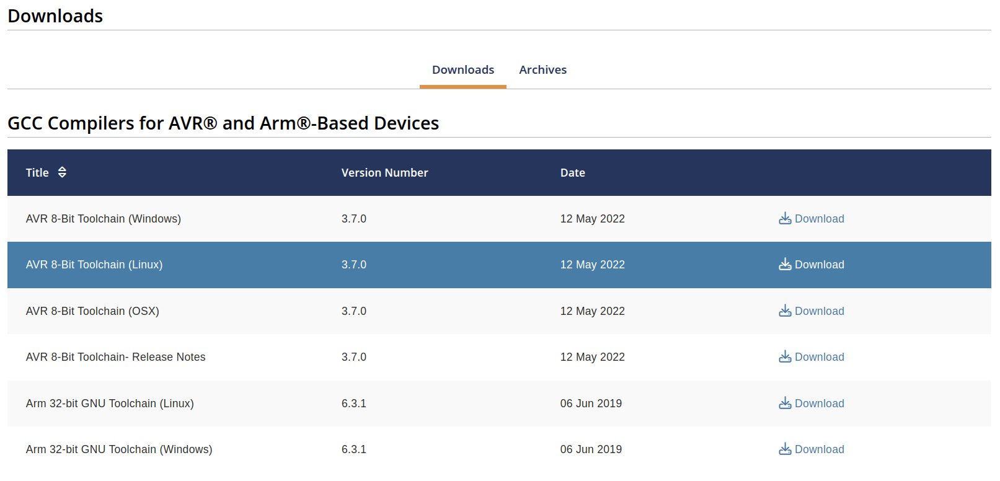
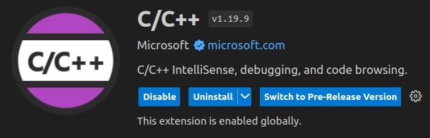
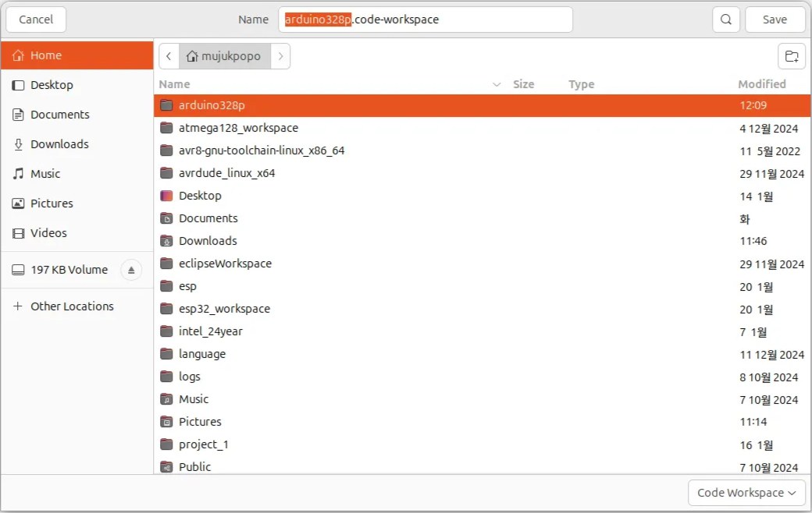
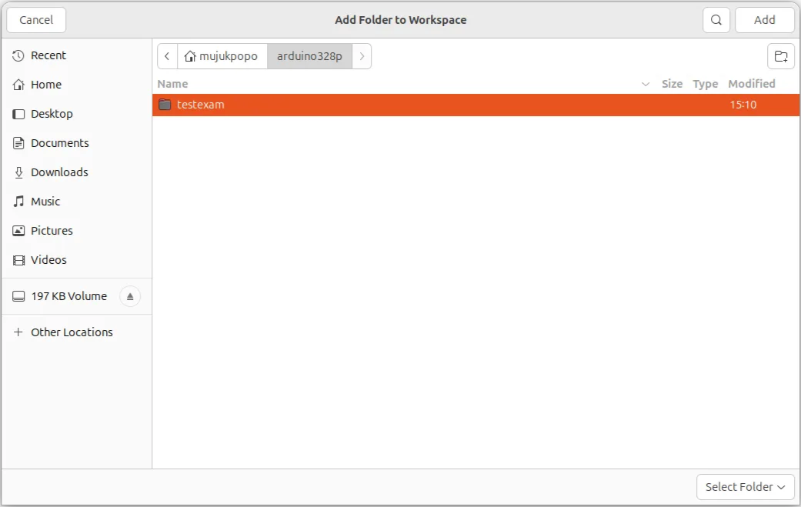
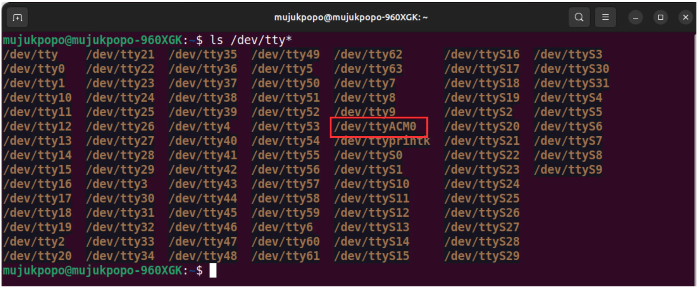

# vscode 환경 설정(Ubuntu24.04)

## **1. ATmega328p 개발에 필요한 toolchain 설치**

## ✅ 1. avr-gcc 를 설치하기 위해 microchip 사이트로 가자 !!

[https://www.microchip.com/en-us/tools-resources/develop/microchip-studio/gcc-compilers](https://www.microchip.com/en-us/tools-resources/develop/microchip-studio/gcc-compilers)

- **Linux 버전을 다운받자**



- **다운받은 후 터미널에서**

```bash
**cd ~/Downloads
tar -xf avr8-gnu-toolchain-*-linux.any.x86_64.tar.gz
sudo mkdir -p /opt/microchip/avr-gcc
sudo mv avr8-gnu-toolchain-linux_x86_64/* /opt/microchip/avr-gcc/**
```


## ✅ 2. 환경변수 설정 (`~/.bashrc` 또는 `~/.zshrc`)

```bash
**export PATH=/opt/microchip/avr-gcc/bin:$PATH**
```


- **설정 반영**

```bash
**source ~/.bashrc   # 또는 source ~/.zshrc**
```


---

## ✅ 3. 설치 확인

```bash
**avr-gcc --version**
```

- **정상 출력되면 설치 성공!**


---

### ➡️**나머지 설치 정리: 한방에 설치**

```bash
**sudo apt update**
```


```bash
**sudo apt install -y avrdude cmake make**
```

- **`avrdude`: 업로드 도구**
- **`cmake`, `make`: 빌드 도구**


### ➡️ **설치 버전 확인 및 위치 확인**

- **avrdude**


- **cmake**


- **make**


## **✅ 4**. VScode 확장 모듈 설치

- **C/C++**



- **CMake**


- **CMake Tools**


## **✅ 5. 작업영역(workspace)생성**

```bash
**mkdir ~/arduino328p**
```


### ➡️ vscode 를 실행

- **File->Save Workspace As... 를 선택**


- **arduino328p 선택하고**
- **워크스페이스 이름을 정함**



- **vscode 상단을 보면 워크페이스 이름이 바뀜**


## **✅ 6. 프로젝트 폴더 선택(또는 생성)**

- **testexam 폴더를 arduino328p 폴더내에 생성한다**

```bash
**mkdir arduino328p/testexam
cd arduino328p
ls -l**
```


- **vscode : File → Add Folder to Workspace… 선택**


- **testexam 폴더를 찾아가 Add 시킨다**



- **Yes 클릭**


- **좌측 상단의 Explorer 클릭**


- testexam 폴더가 추가된것을 볼수 있음


## **✅ 7**. CMake Tools 설정

- **Visual Studio Code의 확장모듈 중에 CMake Tools를 선택하고 톱니바퀴를 누르면 나오는 메뉴중에 Extension Settings를 선택**


- **설정값을 어느범위로 할 것이냐를 선택해야 하는데 User를 선택하면 항상 적용이 되고,**
- **Workspace를 적용하면 현재 Open한 워크스페이스에 저장이 되어서 워크스페이스별로 설정을 달리 하고자 할때는 Workspace로 설정한다**
- **우리는 Workspace를 선택**


- **Cmake: Configure Args**
    - **옵션 중에 Configure Args를 아래 2개의 정의값을 추가한다.**
    - **AVR_TOOLCHAIN_DIR은 이전에 다운로드 받은 AVR GCC 컴파일러의 실행파일 위치임**
    - **CMAKE_MAKE_PROGRAM은 make 실행파일의 위치임**
    - **주의 할 것은 폴더의 슬래시문자를 리눅스에서 사용하는 슬래시로 입력해야 한다.**
    - **윈도우타입인 역슬래시를 입력하면 안됨**

```c
**-DAVR_TOOLCHAIN_DIR=/opt/microchip/avr-gcc
-DCMAKE_MAKE_PROGRAM=/usr/bin/make**
```


- **Cmake: Generator**
    - **빌드프로그램을 make를 사용하기 때문에 Generator 옵션에 Unix Makefiles로 입력**

```bash
**Unix Makefiles**
```


- **Toolchain Kit 설정**
    - **이제는 빌드를 위한 Toolchain Kit을 설정해야 한다**
    - **먼저 펌웨어 폴더 아래에 tools 폴더를 생성한다**


- **CMake의 툴체인 설정 파일을 생성함 →avr-toolchain.cmake**
- **어떤 컴파일러, 링커, 아키텍처를 사용할지 지정하는 설정 파일**


```bash
**# CMake 프로젝트에 AVR 플랫폼 설정
set(CMAKE_SYSTEM_NAME Generic)  # 시스템 이름을 'Generic'(범용)으로 설정
set(CMAKE_SYSTEM_PROCESSOR AVR) # 프로세서를 AVR 마이크로컨트롤러로 설정

# 타겟 MCU 설정 (2025.04.11 수정 사항)
set(MCU atmega328p) # 사용할 마이크로컨트롤러를 ATmega128A로 설정
set(CMAKE_C_FLAGS "-mmcu=${MCU} -DF_CPU=16000000UL -Os")    # MCU 설정 + F_CPU + 최적화
set(CMAKE_CXX_FLAGS "-mmcu=${MCU}") # C++ 컴파일러에 MCU 설정 플래그 전달

# AVR Toolchain 경로 설정
set(BINUTILS_PATH ${AVR_TOOLCHAIN_DIR}) # AVR 도구체인 루트 디렉토리 지정

# AVR Toolchain 실행 파일 경로 설정
set(TOOLCHAIN_PREFIX ${AVR_TOOLCHAIN_DIR}/bin/avr-) # AVR 컴파일러 및 유틸리티 파일 경로 접두사 설정

# CMake 테스트 빌드 대상 유형 설정
set(CMAKE_TRY_COMPILE_TARGET_TYPE STATIC_LIBRARY) # CMake의 테스트 컴파일을 정적 라이브러리로 제한

# 컴파일러 경로 설정
set(CMAKE_C_COMPILER "${TOOLCHAIN_PREFIX}gcc" CACHE FILEPATH "C Compiler path") # C 컴파일러 경로
set(CMAKE_ASM_COMPILER ${CMAKE_C_COMPILER}) # ASM(어셈블리) 컴파일러를 C 컴파일러와 동일하게 설정
set(CMAKE_CXX_COMPILER "${TOOLCHAIN_PREFIX}g++" CACHE FILEPATH "C++ Compiler path") # C++ 컴파일러 경로

# AVR에서 사용하는 추가 유틸리티 경로 설정
set(CMAKE_OBJCOPY ${TOOLCHAIN_PREFIX}objcopy CACHE INTERNAL "objcopy tool") # 바이너리 변환 유틸리티 설정
set(CMAKE_SIZE_UTIL ${TOOLCHAIN_PREFIX}size CACHE INTERNAL "size tool") # 바이너리 크기 확인 유틸리티 설정

# C/C++ 표준 버전 설정
set(CMAKE_C_STANDARD    11) # C 언어 표준을 C11로 설정
set(CMAKE_CXX_STANDARD  11) # C++ 언어 표준을 C++11로 설정

# 컴파일러 확인 단계 비활성화
set(CMAKE_C_COMPILER_FORCED TRUE) # C 컴파일러 강제 사용 (검사 생략)
set(CMAKE_CXX_COMPILER_FORCED TRUE) # C++ 컴파일러 강제 사용 (검사 생략)

# 컴파일 및 링크 시 사용할 검색 경로 설정
set(CMAKE_FIND_ROOT_PATH ${BINUTILS_PATH})   # 검색 루트 경로를 도구체인 경로로 설정
set(CMAKE_FIND_ROOT_PATH_MODE_PROGRAM NEVER) # 프로그램 검색 시 루트 경로 사용 안 함
set(CMAKE_FIND_ROOT_PATH_MODE_LIBRARY ONLY) # 라이브러리 검색 시 루트 경로만 사용
set(CMAKE_FIND_ROOT_PATH_MODE_INCLUDE ONLY) # 헤더 파일 검색 시 루트 경로만 사용
set(CMAKE_FIND_ROOT_PATH_MODE_PACKAGE ONLY) # 패키지 검색 시 루트 경로만 사용**
```

- **Toolchain Kit 설정파일을 만들기 위해서 testexam폴더 밑에 .vscode 폴더를 생성하고**
- **그 아래에 cmake-kits.json 이름으로 새로운 파일을 생성**

```
**🧩 cmake-kits.json이란?

	- VSCode의 CMake Tools 확장 기능에서 사용하는 설정 파일
	- CMake에서 사용할 툴체인이나 컴파일러 환경(KIT)을 VSCode에 알려주는 역할을 함
	- 이 파일은 보통 .vscode/ 폴더 안에 있고, 여러 개의 빌드 환경을 저장해두고 선택할 수 있도록 도와줌

✅ 왜 필요해?
	- avr-toolchain.cmake는 CMake 자체에 알려주는 설정이고,
	- cmake-kits.json은 VSCode에서 툴체인을 선택할 수 있도록 UI에 보여주는 용도임
	
👉 즉, cmake-kits.json을 쓰면 VSCode에서 "이 툴체인 쓸래!" 하고 툴체인을 클릭해서 선택할 수 있음**
```

```json
**주석지원 안함 !!!!

[
    {
        "name": "AVR-GCC Embedded",     // VSCode에서 선택할 이름-> 지워야 함
        "toolchainFile": "${workspaceFolder}/tools/avr-toolchain.cmake"  //툴체인 파일 경로-> 지우셈
    }
]**
```

## **✅ 8. CMake Configuration**

- **CMake : Quick Start 를 선택**


- **프로젝트 이름을 넣음**


- **C Create C project 선택**


- **실행파일 만들꺼니까.. Executable 선택**


- **그냥 OK 선택**


### 🔍 의미는?

- 이건 CMake에서 제공하는 **추가 옵션 선택 화면**

| **옵션** | **설명** |
| --- | --- |
| **CPack** | **CMake 프로젝트에서 **설치/배포 패키지 (ex: .deb, .rpm 등)**를 만들 수 있게 해주는 모듈** |
| **CTest** | **CMake에서 **테스트 프레임워크 (ex: 단위 테스트)**를 사용할 수 있게 해주는 모듈** |

---

### 🔍 AVR 프로젝트에서는?

- AVR 마이컴 프로젝트에서는 **둘 다 필요 없음** (우노에서는 테스트 자동화나 패키징이 거의 없음)
- 그냥 **선택 안 하고 OK 눌러도 전혀 문제 없음**

---

### 🛠 트러블이 생기면….


---

- **F1 키를 누르고 CMake: Configure를 선택**
- **CMake Configuration을 실행하면 CMakeLists.txt 파일이 생성이 되고 기본적인 main.c 파일이 생성이 된다**


- **Select a Kit 메뉴가 나오면 이전에 추가했던 AVR-GCC 툴킷을 선택**


- **기본적인 CmakeList.txt 가 생성됨**


- **main.c 파일을 아래와 같이 변경**


- **다시 F1을 눌러 CMake:Configure를 실행**


- **이번에 실행을 하면 Toolchain Kit과 CMakeLists.txt 기반으로 빌드환경이 만들어 짐**


- **build 폴더가 생성되고 이곳에 빌드와 관련된 파일들이 생성된 것을  볼수 있다**


## **✅ 9. CMake Build**

- **이제 빌드 환경은 다 만들어 졌고 실제로 빌드를 함**
- **F1을 눌러서 CMake: Build를 실행하거나 하단의 Build 아이콘을 누르면 빌드가 진행됨**


- **빌드완료**


## **✅ 10. CMakeList.txt 파일을 아래 내용으로 수정**

- **CMakeList에는 컴파일/링커 옵션과 hex파일을 생성하는 부분까지 추가**

```c
**cmake_minimum_required(VERSION 3.10.0)

project(atmega328p
  LANGUAGES ASM C CXX
)

set(EXECUTABLE ${PROJECT_NAME}.elf)

# 소스 파일 수집
file(GLOB SRC_FILES CONFIGURE_DEPENDS
  *.c
  *.cpp
)

file(GLOB_RECURSE SRC_FILES_RECURSE CONFIGURE_DEPENDS
  src/*.c
  src/*.cpp
)

# 실행 파일 생성
add_executable(${EXECUTABLE}
  ${SRC_FILES}
  ${SRC_FILES_RECURSE}
)

# 컴파일 타임 매크로
target_compile_definitions(${EXECUTABLE} PRIVATE
  -DF_CPU=16000000UL
)

# include 디렉토리 설정
target_include_directories(${EXECUTABLE} PRIVATE
  src 
  src/ap
  src/bsp
  src/hw
  src/common
  src/common/hw/include
)

# 컴파일러 옵션
target_compile_options(${EXECUTABLE} PRIVATE
  -fdata-sections
  -ffunction-sections
  -MMD
  -flto
  -fno-fat-lto-objects

  -Wall
  -Os
  -g3
)

# 링커 옵션
target_link_options(${EXECUTABLE} PRIVATE
  -flto 
  -fuse-linker-plugin

  -lm
  -Wl,-Map=${CMAKE_BINARY_DIR}/${PROJECT_NAME}.map,--cref
  -Wl,--gc-sections
  -Xlinker -print-memory-usage -Xlinker
)

# 바이너리 파일 생성 (.hex)
add_custom_command(TARGET ${EXECUTABLE}
  POST_BUILD
  COMMAND ${CMAKE_OBJCOPY} -O ihex -R .eeprom ${EXECUTABLE} ${CMAKE_BINARY_DIR}/${PROJECT_NAME}.hex
  COMMENT "Generating HEX file"
)

# EEPROM 파일 생성 (.eep)
add_custom_command(TARGET ${EXECUTABLE}
  POST_BUILD
  COMMAND ${CMAKE_OBJCOPY} -O ihex -j .eeprom --set-section-flags=.eeprom=alloc,load --no-change-warnings --change-section-lma .eeprom=0 ${EXECUTABLE} ${CMAKE_BINARY_DIR}/${PROJECT_NAME}.eep
  COMMENT "Generating EEPROM file"
)

# 바이너리 사이즈 출력
add_custom_command(TARGET ${EXECUTABLE}
  POST_BUILD
  COMMAND ${CMAKE_SIZE_UTIL} ${EXECUTABLE}
  COMMENT "Firmware Size:"
)**
```

- **다시 빌드를 하면 이제는 펌웨어 섹션별로 용량이 표시되고  hex파일도 생성되는 것을 볼 수 있다**


## **✅ 11. 다운로드 하기**

- **Arduino 를 컴퓨터에 연결한다**
- **우분투 터미널에서 접속된 포트를 확인**



- **/dev/ttyACM0 의 권한 확인**


- **쓰기 권한이 없으로 쓰기 권한을 추가한다**


- **Terminal → Run Task..를 실행**
- **Tasks는 이클립스에서 External Tools와 비슷한 기능으로 외부의 프로그램을 연결해서 실행 할 수 있는 기능이다**


- **Configure a Task 선택**


- **하단의 Create tasks.json file template → 선택**


- **Other → 선택**


- **아래 그림처럼 .vscode 폴더에 tasks.json 파일이 생성되고 기본적인 템플릿 내용이 보인다**


- **avrdude 의 위치를 확인**


- **task.json 내용을 변경**

```json
**{
  "version": "2.0.0",
  "tasks": [
    {
      "label": "Upload to Arduino Uno",
      "type": "shell",
      "command": "/usr/bin/avrdude",
      "args": [
        "-C", "/etc/avrdude.conf",
        "-v",
        "-u",
        "-p", "atmega328p",
        "-c", "arduino",
        "-P", "/dev/ttyACM0",
        "-b", "115200",
        "-D",
        "-U", "flash:w:build/atmega328p.hex:i"
      ],
      "group": "build"
    }
  ]
}**

```

- **Teminal → Run Task 선택**


- **완료**


====

====

### Task Explorer 에서 사용

```json
**{
    "version": "2.0.0",
    "tasks": [
        {
            "label": "CMake Build",
            "type": "process",
            "command": "cmake",
            "args": [
                "--build",
                "${workspaceFolder}/build",
                "--target",
                "all"
            ],
            "group": {
                "kind": "build",
                "isDefault": true
            },
            "problemMatcher": []
        },
        {
            "label": "CMake Clean",
            "type": "process",
            "command": "cmake",
            "args": [
                "--build",
                "${workspaceFolder}/build",
                "--target",
                "clean"
            ],
            "problemMatcher": []
        },
        {
            "label": "avrdude",
            "type": "shell",
            "command": "/usr/bin/avrdude",
            "args": [                
                "-v",
                "-u",
                "-p", "atmega328p",
                "-c", "arduino",
                "-P", "/dev/ttyACM0",
                "-b", "115200",
                "-D",
                "-U", "flash:w:build/atmega328p.hex:i"
            ],
            "problemMatcher": []
        },
        {
            "label": "Build",
            "dependsOrder": "sequence",
            "dependsOn": [
                "CMake Build",
                "avrdude"
            ],
            "group": {
                "kind": "build",
                "isDefault": true
            }
        },
        {
            "label": "Clean",
            "dependsOrder": "sequence",
            "dependsOn": [
                "CMake Clean"
            ]
        }
    ]
}**
```
